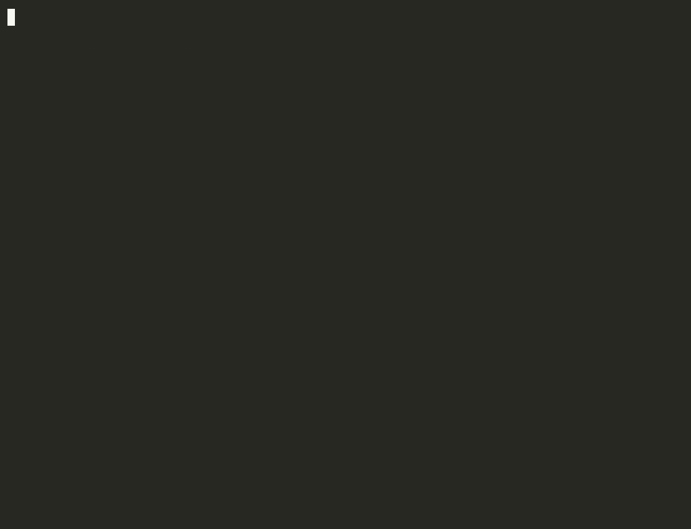

# nix-cf-proof

One `devenv.nix` builds a `git` that cannot force-push. The same file gives you that git on your Mac and in a live Cloudflare Container. Cloudflare builds the container image itself, in a Cloudflare Container. No Docker. No GitHub Actions.



```sh
./proof.sh
```

The recording comes from [`scripts/demo.sh`](scripts/demo.sh), which reads live output and receipts. An MP4 is in [`media/proof.mp4`](media/proof.mp4).

`proof.sh` exits 0 only when every row below is true. The last passing run is in [`receipts/gate.json`](receipts/gate.json).

| Claim | Evidence |
| --- | --- |
| The image was built on Cloudflare | [`receipts/cloudflare-build.json`](receipts/cloudflare-build.json): microVM kernel, Cloudflare location, Durable Object ID |
| The deployed image is the exact image that build pushed | `proof.sh` compares the digest in `wrangler.jsonc` with the build receipt |
| The container runs the git the build produced | [`receipts/container-identity.json`](receipts/container-identity.json): same Nix store path as the build receipt |
| Mac and container run the same patched git | Same `git --version` and same overlay patch SHA-256 in both places |
| Every force push fails, on both | [`receipts/local-force-push.txt`](receipts/local-force-push.txt) and [`receipts/container-sandbox.json`](receipts/container-sandbox.json) |
| Full NixOS boots in a Cloudflare Container | [`receipts/container-systemd.json`](receipts/container-systemd.json): systemd is PID 1 |

## What the patched git refuses

A normal fast-forward push still works. These all fail, and the remote branch does not move:

- `git push --force`
- `git push -f`
- `git push --force-with-lease`
- `git push origin +HEAD:main`
- a `+refspec` in `remote.<name>.push`
- `git push --mirror`

The change is one patch to `remote.c`, in [`nix/patches/refuse-forced-ref-updates.patch`](nix/patches/refuse-forced-ref-updates.patch). Git decides whether a ref update needs force in one function, `set_ref_status_for_push`. The patch stops git there when an update would only succeed by force. Every force flag reaches that function, so one change covers them all.

An agent cannot get around this with a flag, a hook, or a config value. The force path is not in the binary.

## How the build runs on Cloudflare

1. `scripts/cloud-build.sh` asks the Worker to start a builder Container from Cloudflare's managed `cloudflare/debian-trixie` image.
2. The builder downloads static Nix, checks out this commit, and runs `devenv build`.
3. It pushes the image to the Cloudflare registry with `skopeo` and writes a receipt.
4. `scripts/promote.sh` waits until Cloudflare prepares the image, pins it by digest in `wrangler.jsonc`, and deploys.

## Run it yourself

You need Nix, devenv, and a Cloudflare account with Containers.

```sh
nix profile add github:cachix/devenv/v2.4.0
npm install
npx wrangler secret put PROOF_TOKEN
npx wrangler deploy
./scripts/cloud-build.sh
./scripts/promote.sh
./proof.sh
```

Behind Cloudflare WARP, Nix needs the WARP root certificate. Refer to [`receipts/BLOCKERS.md`](receipts/BLOCKERS.md).

## Findings

- **Cloudflare cannot prepare `dockerTools.buildLayeredImage` images.** The image preparation API reports `runtime image build failed`. Wrangler shows only "Preparing" and times out after 15 minutes. Single-layer `dockerTools.buildImage` images work. The test table is in [`receipts/BLOCKERS.md`](receipts/BLOCKERS.md).
- **NixOS boots with systemd as PID 1.** `systemctl is-system-running` reports `degraded`. `firewall.service` and `nscd.service` fail. journald, udevd, logind, and dbus run.
- **The first build compiles git from source.** It takes about 10 minutes on a Mac and in a Cloudflare `standard-4` container. Cached builds take about 4 minutes.

## Credits

The idea of patching git so agents cannot force-push comes from Geoffrey Huntley's [nix-demo](https://github.com/ghuntley/nix-demo) and his post [the world hasn't figured out yet that you can literally just fix everything with a Nix overlay](https://ghuntley.com/nix/). The patch in this repository is an independent implementation.

## License

MIT
